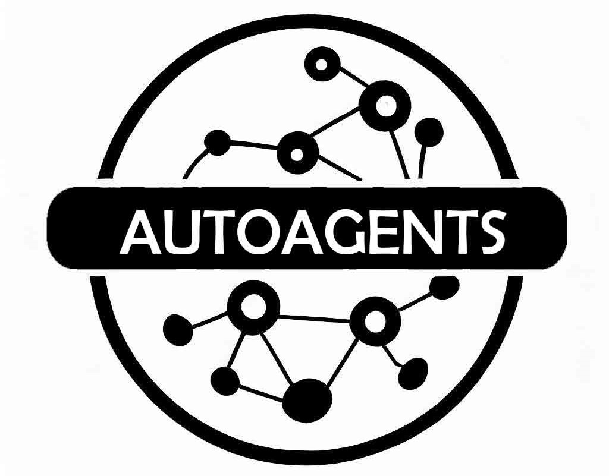
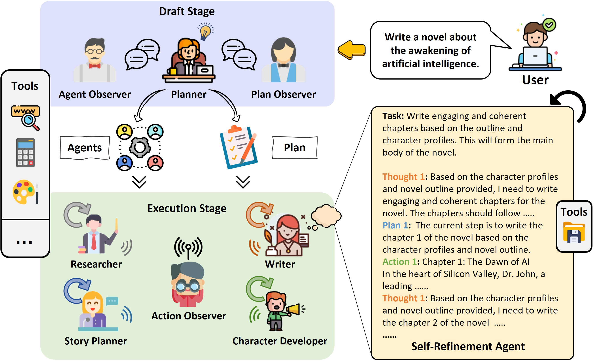

# AutoAgents: エージェント自動生成のフレームワーク

<p align="center">
<a href=""></a>
</p>

<p align="center">
<b>GPT にさまざまな役割を与え、複雑なタスクのための協力体を形成する。</b>
</p>

<p align="center">
<a href="./README_CN.md"></a>
<a href="../README.md"></a>
<a href="./README_JA.md"></a>
<a href="https://opensource.org/licenses/MIT"></a>
</p>

AutoAgents は、LLM に基づいた自動エージェント生成実験のための実験的オープンソースアプリケーションです。このプログラムは、LLM によって駆動され、あなたが設定した目標を達成するためのマルチエージェントを自律的に生成します。

<p align="center">
    
</p>

## <a name="updates"/> :boom: アップデート
- **2023.09.31**: 📝 このリポジトリに関連する論文 [AutoAgents: A Framework for Automatic Agent Generation](https://arxiv.org/abs/2309.17288) を共有できることを嬉しく思います。
<p align="center">

</p>

- **2023.08.30**: 🚀 カスタムエージェントコレクション、AgentBank を追加することで、カスタムエージェントを追加することができます。

## 🚀 特徴
- **プランナー**: 問題に応じて、追加するエキスパートの役割と具体的な実行計画を決定します。
- **ツール**: 使用可能なツール一式で、現在は検索ツールにのみ対応。
- **オブザーバー**: 計画立案者と実行プロセスの結果が妥当であるかどうかを反映する責任を負い、現在はエージェント、計画、アクションの反映チェックが含まれます。
- **エージェント**: プランナーによって生成されたエキスパートロールエージェント（名前、専門知識、使用ツール、LLM エンハンスメントを含む）。
- **プラン**: 実行計画は、生成されたエキスパートロールによって構成され、実行計画の各ステップには、少なくとも 1 つのエキスパートロールエージェントが存在する。
- **アクション**: ツールの呼び出しや結果の出力など、実行計画における専門家の役割の具体的なアクション。

## デモ
オンラインデモ:
- [Demo / Hugging Face Spaces](https://huggingface.co/spaces/LinkSoul/AutoAgents)

ビデオデモ:
- **噂の検証**
<video src='https://github.com/shiyemin/AutoAgents/assets/1501158/41898e0d-4137-450c-ad9b-bfb9b8c1d27b.mp4'></video>
- **食いしん坊のヘビ**
<video src='https://github.com/shiyemin/AutoAgents/assets/1501158/97e408cb-b70d-4045-82ea-07319c085138.mp4'></video>

## インストールと使用方法

### インストール

```bash
git clone https://github.com/LinkSoul-AI/AutoAgents
cd AutoAgents
python setup.py install
```

### コンフィグ

- `config/key.yaml / config/config.yaml / env` のいずれかで `OPENAI_API_KEY` を設定します
- 優先順位: `config/key.yaml > config/config.yaml > env`

```bash
# コンフィグファイルをコピーし、必要な変更を加えます。
cp config/config.yaml config/key.yaml
```

| 変数名                                      | config/key.yaml                           | env                                             |
| ------------------------------------------ | ----------------------------------------- | ----------------------------------------------- |
| OPENAI_API_KEY # 自分のキーに置き換える        | OPENAI_API_KEY: "sk-..."                  | export OPENAI_API_KEY="sk-..."                  |
| OPENAI_API_BASE # オプション                 | OPENAI_API_BASE: "https://<YOUR_SITE>/v1" | export OPENAI_API_BASE="https://<YOUR_SITE>/v1" |

### 使用方法
- コマンドラインモード:
```python
python main.py --mode commandline --llm_api_key YOUR_OPENAI_API_KEY --serapi_key YOUR_SERPAPI_KEY --idea "Is LK-99 really a room temperature superconducting material?"
```
- Websocket サービスモード:
```python
python main.py --mode service --host "127.0.0.1" --port 9000
```

### Docker
- docker イメージをビルドする:
```bash
IMAGE="linksoul.ai/autoagents"
VERSION=1.0

docker build -f docker/Dockerfile -t "${IMAGE}:${VERSION}" .
```
- docker コンテナを起動する:
```bash
docker run -it --rm -p 7860:7860 "${IMAGE}:${VERSION}"
```
- ブラウザで http://127.0.0.1:7860 を開く。

## 連絡先

このプロジェクトに関するご質問やご意見がございましたら、お気軽にお問い合わせください。皆様のご意見をお待ちしております！

- **Email:** gy.chen@foxmail.com, ymshi@linksoul.ai
- **GitHub Issues:** 技術的なお問い合わせについては、[GitHub リポジトリ](https://github.com/LinkSoul-AI/AutoAgents/issues) に新しい課題を作成することもできます。

ご質問には 2-3 営業日以内に回答いたします。

## ライセンス

[MIT license](https://raw.githubusercontent.com/LinkSoul-AI/AutoAgents/main/LICENSE)

## 引用

もし私たちの仕事やこのリポジトリが役に立つと思われましたら、:star: をつけて引用することをご検討ください :beer::
```bibtex
@article{chen2023auto,
  title={AutoAgents: The Automatic Agents Generation Framework},
  author={Chen, Guangyao and Dong, Siwei and Shu, Yu and Zhang, Ge and Jaward, Sesay and Börje, Karlsson and Fu, Jie and Shi, Yemin},
  journal={arXiv preprint},
  year={2023}
}
```

## Wechat グループ


## 謝辞
このコードベースの [system](https://github.com/LinkSoul-AI/AutoAgents/tree/main/autoagents/system)、[action_bank](https://github.com/LinkSoul-AI/AutoAgents/tree/main/autoagents/actions/action_bank)、[role_bank](https://github.com/LinkSoul-AI/AutoAgents/tree/main/autoagents/roles/role_bank) は、[MetaGPT](https://github.com/geekan/MetaGPT) を使って構築されています

Darius Dan、Freepik、kmg design、Flat Icons、[FlatIcon](https://www.flaticon.com) の Vectorslab によって作られたフレームワークのアイコンです
